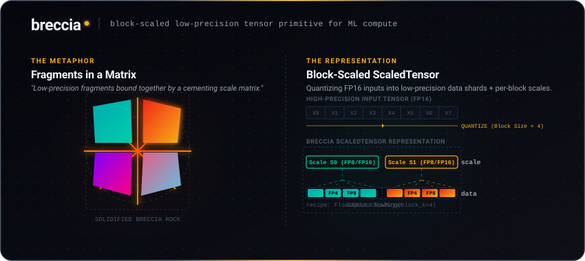

<p align="center">
  
</p>

<h3 align="center">A cross-framework block-scaled tensor primitive for low-precision compute (FP8 / FP4 / MXFP8 / NVFP4 / INT4).</h3>


```python
import numpy as np
import breccia

# Quantize a tensor to FP8 with per-block-K scaling (DeepSeek-v3 style).
x = np.random.randn(8, 256).astype(np.float32)
st = breccia.cast(x, breccia.Float8BlockScaling(block_k=128))

# Scaled matmul: data stays in FP8, scales fold into the FP32 accumulator.
A = breccia.cast(np.random.randn(16, 256).astype(np.float32),
                 breccia.Float8CurrentScaling())
W = breccia.cast(np.random.randn(256, 64).astype(np.float32),
                 breccia.Float8BlockScaling(block_k=128))
y = breccia.matmul(A, W)
```

## Why

Every framework today reinvents block-scaled low-precision in
incompatible ways:

- **NVIDIA TransformerEngine** ships four parallel recipe classes
  (`DelayedScaling`, `Float8CurrentScaling`, `Float8BlockScaling`,
  `MXFP8BlockScaling`) — NVIDIA-only.
- **PyTorch torchao** rolls its own `AffineQuantizedTensor` — PyTorch-only.
- **DeepSeek-v3** has a private FP8 format. **FP8-Flow-MoE** (Nov 2025)
  has another. **COAT** has another for optimizer-state compression.
- **Megatron, JAX, TorchTitan** each re-derive scale-aware all-gather.
- **AMD MI355**, **Trainium2**, **TPU v6** all have incompatible scale
  semantics across vendors.

No vendor can be the neutral substrate (NVIDIA can't ship for AMD, AMD
can't ship for TPU). The cross-vendor gap is *widening* through 2026–2027
with FP4. breccia is the "safetensors of low-precision" — one neutral
primitive that round-trips with each of them.

Sister library to [`scree`](https://github.com/jvoltci/scree):
- **scree** handles variable-length data (loose fragments).
- **breccia** handles low-precision data bound by its scale (fragments + cement).

## What you get

A single core type — `ScaledTensor(data, scale, recipe, layout)` — plus
six recipes, four layouts, five bridges, and reference + Triton kernels.

**Six recipes** covering 95% of today's fragmentation:

| Recipe | Format | Block size | Used by |
| --- | --- | --- | --- |
| `DelayedScaling` | FP8 E4M3 / E5M2 | per-tensor | TE main recipe |
| `Float8CurrentScaling` | FP8 E4M3 / E5M2 | per-tensor | TE / torchao |
| `Float8BlockScaling` | FP8 E4M3 / E5M2 | 128 along K | DeepSeek-v3 |
| `MXFP8BlockScaling` | FP8 + E8M0 scale | 32 along K | OCP MX standard |
| `NVFP4BlockScaling` | FP4 E2M1 + FP8 scale | 16 along K | NVIDIA Blackwell |
| `INT4Scaling` | INT4 ± fp16 scale | configurable | GPTQ / AWQ family |

**Five bridges** for zero-copy interop:

| Bridge | Direction | Dep |
| --- | --- | --- |
| `from_transformer_engine` / `to_transformer_engine` | TE Float8Tensor ↔ ScaledTensor | `transformer-engine` |
| `from_torchao` / `to_torchao` | AffineQuantizedTensor ↔ ScaledTensor | `torchao` |
| `save_safetensors` / `load_safetensors` | safetensors file ↔ dict of ScaledTensor | `safetensors` |
| `to_dlpack` / `from_dlpack` | zero-copy across NumPy / PyTorch / MLX / JAX | built-in |
| `from_deepseek_v3` / `to_deepseek_v3` | DeepSeek-v3 buffers ↔ ScaledTensor | none |

**Memory savings vs FP32**, computed at v0.0.1 (`(1024, 1024)` weight):

| Format | Bytes | vs FP32 |
| --- | --- | --- |
| FP32 | 4.19 MB | 1.00× |
| FP16 | 2.10 MB | 0.50× |
| FP8 (Float8CurrentScaling) | 1.05 MB | **0.25×** |
| FP8 (Float8BlockScaling, b=128) | 1.08 MB | **0.26×** |
| MXFP8 (block 32, E8M0 scale) | 1.08 MB | **0.26×** |
| NVFP4 (block 16, E4M3 scale) | 1.11 MB | **0.27×** |
| INT4 (group 128, fp16 scale) | 1.06 MB | **0.25×** |

Reproduce: `python benchmarks/bench_memory.py`

**Accuracy** (cosine similarity vs FP32 on Gaussian inputs, mean over 8 seeds):

| Recipe | Cos sim |
| --- | --- |
| Float8CurrentScaling (E4M3) | 0.9997 |
| Float8BlockScaling(block_k=128) | 0.9997 |
| MXFP8BlockScaling | 0.9974 |
| NVFP4BlockScaling | 0.9955 |
| INT4Scaling(group_size=128) | 0.9932 |

Reproduce: `python benchmarks/bench_accuracy.py`

## Status

v0.1.0, first beta release.

| Component | Status |
| --- | --- |
| `ScaledTensor` type + invariants | ✅ |
| 6 ScalingRecipes | ✅ |
| 4 Layouts | ✅ |
| `cast` / `dequantize` / `matmul` / `requantize` | ✅ |
| Bridges: TE / torchao / HF / DLPack / DeepSeek-v3 | ✅ |
| NumPy + PyTorch + MLX + JAX backends | ✅ |
| Triton FP8 scaled matmul (per-tensor) | ✅ validated on H100 (cos sim 0.9993 vs FP32) |
| Straight-through estimator (`cast_ste`, `cast_ste_clipped`) | ✅ |
| Asymmetric INT4 (zero-point) | ✅ |
| Block-scaled Triton kernel | 🟡 v0.2 (per-tensor only in v0.1) |
| Native PyTorch FP8 acceleration (vs round-trip) | 🟡 v0.2 |

250+ tests passing. CI on Python 3.10 / 3.11 / 3.12 (Ubuntu) + 3.11 (macOS).

## Install

```bash
pip install breccia                     # NumPy backend
pip install "breccia[torch]"            # + PyTorch
pip install "breccia[mlx]"              # + MLX (Apple Silicon)
pip install "breccia[bridges]"          # + safetensors for HF bridge
pip install "breccia[torch,mlx,bridges,dev]"  # full dev setup
```

## Examples

- [`examples/01_quickstart.py`](examples/01_quickstart.py) — cast + matmul
- [`examples/02_recipe_portable_train.py`](examples/02_recipe_portable_train.py)
  — train MXFP8, ship NVFP4 (same model code)
- [`examples/03_checkpoint_with_scale.py`](examples/03_checkpoint_with_scale.py)
  — save/load safetensors with scale metadata
- [`examples/04_te_migration.py`](examples/04_te_migration.py)
  — bridge from TransformerEngine

## Documentation

- [**Getting started**](docs/getting-started.md) — install + first program
- [**Concepts**](docs/concepts.md) — mental model: data + scale + recipe + layout
- [**Recipes**](docs/recipes.md) — when to use each of the 6 recipes
- [**Formats**](docs/formats.md) — bit-level FP8 / FP4 / INT4 / E8M0 layouts
- [**API reference**](docs/api.md) — every public function and class
- [**Bridges & migration**](docs/bridges.md) — TE / torchao / HF / DLPack / DeepSeek
- [**Kernels**](docs/kernels.md) — reference and Triton scaled-matmul design
- [**Numerics**](docs/numerics.md) — accuracy / range trade-offs
- [**Architecture**](docs/architecture.md) — internals, design decisions
- [**Benchmarks**](docs/benchmarks.md) — methodology + reproduction
- [**FAQ**](docs/faq.md)

## The name

A breccia is a sedimentary rock made of broken angular fragments held
together by a cementing matrix. Low-precision data fragments + the scale
matrix that gives them meaning — same structure.

It's the natural geological successor to
[`scree`](https://github.com/jvoltci/scree): loose fragments (scree)
become breccia when cemented together.

## Contributing

PRs welcome. See [CONTRIBUTING.md](CONTRIBUTING.md) for the workflow. Open
a GitHub Discussion for anything beyond a small fix.

## License

Apache-2.0
